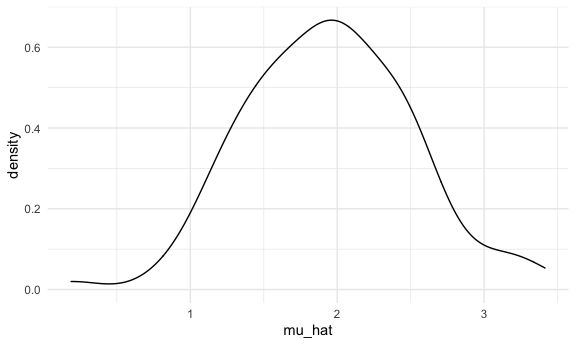
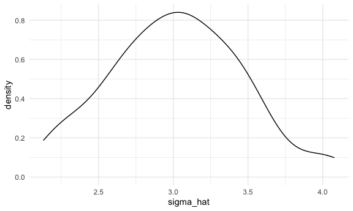
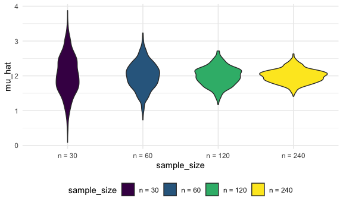

DSextra
================
Hening CUi
11/13/2021

    ## ── Attaching packages ─────────────────────────────────────── tidyverse 1.3.1 ──

    ## ✓ ggplot2 3.3.5     ✓ purrr   0.3.4
    ## ✓ tibble  3.1.5     ✓ dplyr   1.0.7
    ## ✓ tidyr   1.1.4     ✓ stringr 1.4.0
    ## ✓ readr   2.0.2     ✓ forcats 0.5.1

    ## ── Conflicts ────────────────────────────────────────── tidyverse_conflicts() ──
    ## x dplyr::filter() masks stats::filter()
    ## x dplyr::lag()    masks stats::lag()

## let simulate sth

i have a function

``` r
sim_mean_sd = function(n, mu = 2, sigma = 3) {
  
  sim_data = tibble(
    x = rnorm(n, mean = mu, sd = sigma),
  )
  
  sim_data %>% 
    summarize(
      mu_hat = mean(x),
      sigma_hat = sd(x)
    )
}
```

i can simulate it

``` r
sim_mean_sd(30)
```

    ## # A tibble: 1 × 2
    ##   mu_hat sigma_hat
    ##    <dbl>     <dbl>
    ## 1   2.24      3.15

## let simulate a lot

lets start with a for loop

``` r
output = vector("list", length = 100)

for (i in 1:100) {
  output[[i]] = sim_mean_sd( 30)
}
bind_rows(output)
```

    ## # A tibble: 100 × 2
    ##    mu_hat sigma_hat
    ##     <dbl>     <dbl>
    ##  1   2.46      2.26
    ##  2   2.13      2.40
    ##  3   2.29      3.23
    ##  4   1.12      2.29
    ##  5   2.31      2.75
    ##  6   1.91      2.67
    ##  7   1.86      3.32
    ##  8   3.06      2.77
    ##  9   2.51      3.39
    ## 10   2.06      2.43
    ## # … with 90 more rows

lets use a loop function

``` r
sim_results = 
  rerun(100, sim_mean_sd( 30)) %>% 
  bind_rows()
```

let look at result

``` r
sim_results %>% 
  ggplot(aes(x = mu_hat)) + geom_density()
```



``` r
sim_results %>% 
  summarize(avg_mean = mean(mu_hat),
            sd_mean = sd(mu_hat))
```

    ## # A tibble: 1 × 2
    ##   avg_mean sd_mean
    ##      <dbl>   <dbl>
    ## 1     1.94   0.565

``` r
sim_results %>% 
  ggplot(aes(x = sigma_hat))+ geom_density()
```


## try other sample size

``` r
n_list =
  list(
    "n = 30" = 30,
    "n = 60" = 60,
    "n = 120" = 120,
    "n = 240" = 240
  )

output = vector("list", length = 4)

for (i in 1:4){
  output[[i]] = rerun(100, sim_mean_sd(n_list[[i]])) %>% 
    bind_rows()
  }
```

``` r
sim_results =
  tibble(
  sample_size = c(30, 60, 120, 240)
) %>% 
  mutate(output_list = map(.x = sample_size, ~rerun(1000, sim_mean_sd(.x))),
         estimate_df = map(output_list, bind_rows))  %>% 
  select(-output_list) %>% 
  unnest(estimate_df)
```

some data frame

``` r
sim_results %>% 
  mutate(
    sample_size = str_c("n = ", sample_size),
    sample_size = fct_inorder(sample_size)) %>% 
  ggplot(aes(x = sample_size, y = mu_hat, fill = sample_size)) + 
  geom_violin()
```



``` r
sim_results %>%
  group_by(sample_size) %>% 
  summarize(avg_mean = mean(mu_hat),
            sd_mean = sd(mu_hat))
```

    ## # A tibble: 4 × 3
    ##   sample_size avg_mean sd_mean
    ##         <dbl>    <dbl>   <dbl>
    ## 1          30     2.03   0.567
    ## 2          60     2.01   0.393
    ## 3         120     1.99   0.274
    ## 4         240     2.00   0.198
